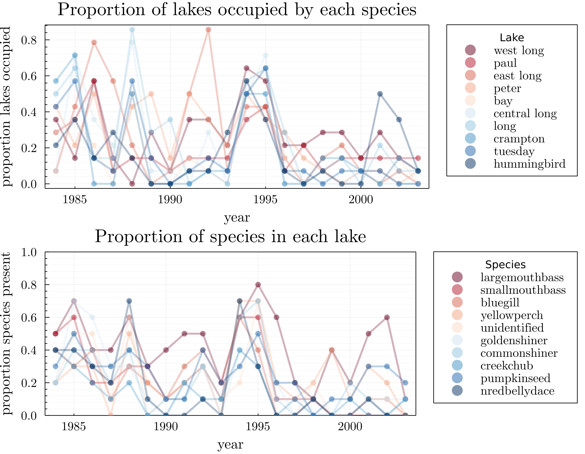

# Introduction

- Relevance and necessity of ecological forecasting
- Clearly, there are many tools from time-series analysis.
- One type of model very succesful in temporal data are a class of neural networks called recurrent.
- Various forms of RNNs: classic RNN, LTSM, GRU, RNN-Turing Machine, ... etc. 

# Methods

# Results

{#fig:occupancy}

# Discussion

# References
